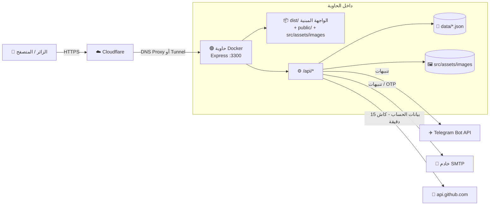
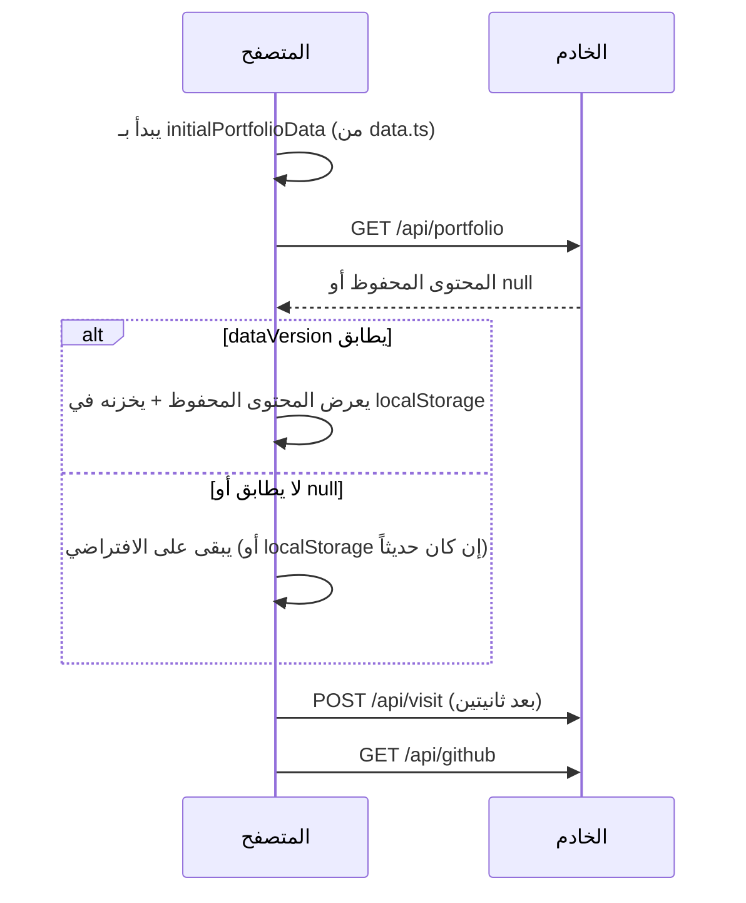
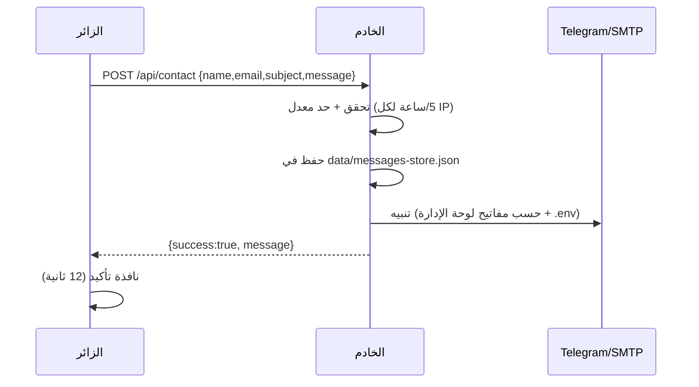
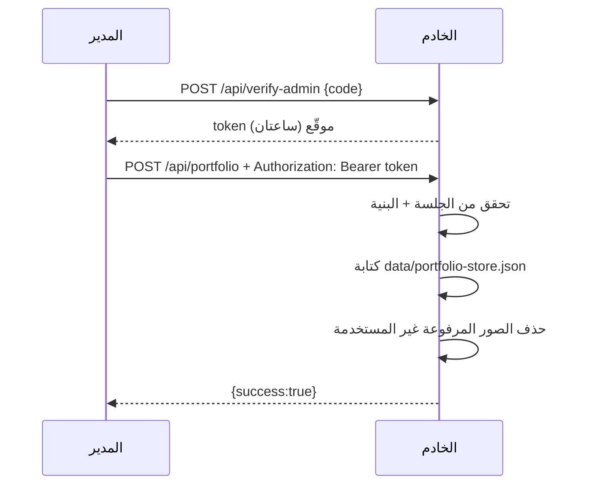

# 1️⃣ البنية العامة (Architecture)

## 1. الفكرة في سطرين

المشروع **تطبيق صفحة واحدة (SPA)** مبني بـ React، يخدمه **خادم Express واحد** هو نفسه الذي يوفّر الـ API.
لا توجد قاعدة بيانات: المحتوى المعدَّل من لوحة الإدارة والرسائل تُحفظ في **ملفات JSON** داخل مجلد `data/`.

## 2. المخطط العام



**نقطة مهمة:** بيانات GitHub يجلبها **الخادم** ويخزّنها 15 دقيقة (`GET /api/github`)، فلا يتصل متصفح الزائر بـ GitHub ولا يتأثر بحد الطلبات.

## 3. التقنيات والإصدارات (حسب `package.json`)

| الطبقة | التقنية | ملاحظة |
| :--- | :--- | :--- |
| الواجهة | React 19 + TypeScript | ملف كبير واحد `App.tsx` |
| الأنماط | Tailwind CSS 4 (عبر `@tailwindcss/vite`) | `@custom-variant dark` للوضع الداكن |
| الأيقونات | `lucide-react` | |
| الأدوات | Vite 8 + `@vitejs/plugin-react` | |
| الخادم | Express 4 + `tsx` | يُشغَّل TypeScript مباشرة بلا ترجمة مسبقة |
| البريد | Nodemailer | SMTP (افتراضياً Gmail) |
| الحاويات | Docker (Node 20 Alpine) متعدد المراحل | |
| الاختبارات | `node:test` + `tsx` | 28 اختباراً (انظر `09-testing.md`) |

## 4. أوضاع التشغيل

| | التطوير (`npm run dev`) | الإنتاج (Docker) |
| :--- | :--- | :--- |
| الأمر | `tsx server.ts` | `tsx server.ts` مع `NODE_ENV=production` |
| تقديم الواجهة | Vite يعمل كـ middleware داخل Express (HMR) | ملفات `dist/` المبنية + `index.html` لأي مسار غير معروف (SPA fallback) |
| المنفذ | `PORT` أو `3300` | `3300` |

> `npm run build` يبني الواجهة فقط (`vite build`)، والحاوية تشغّل `server.ts` عبر `tsx`.

## 5. هيكل المجلدات بالتفصيل

```
myportfolio/
├── index.html                 وسوم SEO، Open Graph، JSON-LD، favicon، canonical
├── server.ts                  خادم Express (≈ 780 سطر): الأمان، الـ API، الملفات الثابتة
├── backend/utils.ts           دوال الخادم النقية القابلة للاختبار
├── tests/                     الاختبارات الآلية (node:test)
├── package.json               السكربتات والاعتماديات
├── vite.config.ts             إضافات Vite (react + tailwind) والمسار المختصر @
├── tsconfig.json              إعدادات TypeScript
├── Dockerfile                 مرحلتان: builder (بناء) و runner (تشغيل)
├── docker-compose.yml         خدمة واحدة + وحدتان دائمتان
├── deploy.sh                  يتحقق من .env ثم up -d --build
├── .dockerignore              يمنع نسخ .env وdata وnode_modules إلى سياق البناء
├── .env.example               نموذج المتغيرات (لا تضع أسراراً فيه)
├── DEPLOYMENT.md              دليل النشر على Oracle + Cloudflare
├── metadata.json              وصف المشروع لمنصة AI Studio (غير مستخدم بالتشغيل)
├── package-lock.json          (غير موجود حالياً؛ ولّده بـ npm install وارفعه — انظر 06)
├── public/                    يُخدَّم من جذر الموقع مباشرة
│   ├── Amro_Nazzal_CV_EN.pdf, Amro_Nazzal_Lebenslauf_DE.pdf
│   ├── favicon.svg, og-image.png (صورة معاينة المشاركة 1200×630)
│   ├── robots.txt, sitemap.xml
│   └── images/amro-portrait.jpg   الصورة الشخصية الافتراضية
├── src/
│   ├── main.tsx               createRoot + StrictMode
│   ├── App.tsx                الحالة والمنطق وتركيب الصفحة (≈ 870 سطر)
│   ├── components/            أقسام الصفحة + admin/ (تبويبات اللوحة)
│   ├── lib/helpers.ts         اللغة، فحص الروابط، نص الشريط
│   ├── data.ts                المحتوى الافتراضي + dataVersion
│   ├── types.ts               واجهات TypeScript
│   ├── i18n.ts                نصوص الواجهة بالثلاث لغات
│   ├── index.css              Tailwind + خطوط + أنيميشن
│   └── assets/
│       ├── images/            صور المشاريع + الصور المرفوعة (user_upload_*)
│       └── docs/              ملفات PDF مختلفة عن التي في public/ (غير مستخدمة في الكود)
└── data/                      (يُنشأ وقت التشغيل) ملفات JSON — خارج Git
```

## 6. مسارات الملفات الثابتة (من يخدم ماذا؟)

الترتيب في `server.ts` مهم:

| المسار في الرابط | المصدر على القرص | ملاحظة |
| :--- | :--- | :--- |
| `/api/*` | مسارات Express | تُسجَّل أولاً |
| `/src/assets/images/*` | `src/assets/images/` | **وحدة Docker دائمة** (انظر فخ الوحدة أدناه) |
| `/*.pdf`, `/favicon.svg`, `/images/*` ... | `public/` | |
| بقية الملفات | `dist/` (إنتاج) | ملفات Vite ذات الأسماء المجزّأة (hash) |
| أي مسار آخر | `dist/index.html` | SPA fallback |

### ⚠️ فخ وحدة الصور

`docker-compose.yml` يربط وحدة مسماة بالمجلد `/app/src/assets/images`. الوحدة المسماة **تُملأ من الصورة مرة واحدة فقط** (عند إنشائها). بعد ذلك:

- أي ملف موجود في الوحدة **يتغلب** على ملف بنفس الاسم في البناء الجديد.
- ملفات جديدة تضيفها لمستودع Git في هذا المجلد **لا تظهر** في الحاوية العاملة.

لذلك: الصور الثابتة الجديدة تُوضع في `public/` (مثل `public/images/`)، ويُترك `src/assets/images/` لصور المشاريع القديمة وللصور التي ترفعها من لوحة الإدارة.

### الكاش وترويسات الأمان

| العنصر | السلوك |
| :--- | :--- |
| `/assets/*` (ملفات Vite ذات الاسم المجزّأ) | كاش سنة كاملة `immutable` |
| `index.html` | `no-cache` (يُعاد التحقق دائماً حتى يصل الإصدار الجديد فوراً) |
| `user_upload_*` (الصور المرفوعة) | كاش سنة `immutable` (الاسم فريد) |
| باقي الصور والملفات | تُعاد مراجعتها (الافتراضي) |
| `Content-Security-Policy-Report-Only` (إنتاج فقط) | يسجّل المخالفات في Console دون أن يحجب شيئاً |

## 7. تدفقات البيانات الرئيسية

### أ) فتح الصفحة



### ب) إرسال رسالة من نموذج التواصل



### ج) حفظ تعديل من لوحة الإدارة



## 8. قرارات تصميمية (ولماذا)

| القرار | السبب | الثمن |
| :--- | :--- | :--- |
| ملفات JSON بدل قاعدة بيانات | موقع شخصي بمدير واحد، بساطة النشر | لا حماية من الكتابة المتزامنة؛ نسخة واحدة من الخادم فقط |
| `App.tsx` ملف واحد | بدأ كقالب سريع | صعوبة الصيانة؛ يُنصح بتقسيمه (انظر ملف الصيانة) |
| رمز جلسة في الذاكرة فقط | لا تخزين أسرار في المتصفح | تسجيل الخروج عند تحديث الصفحة |
| الأسرار في `.env` فقط | لا تظهر في المتصفح ولا في ملف JSON | تغييرها يحتاج إعادة تشغيل الحاوية |
| `dataVersion` | منع ظهور محتوى قديم مخزّن بعد تحديث `data.ts` | تعديلات لوحة الإدارة السابقة تُتجاهل عند رفع الرقم |
