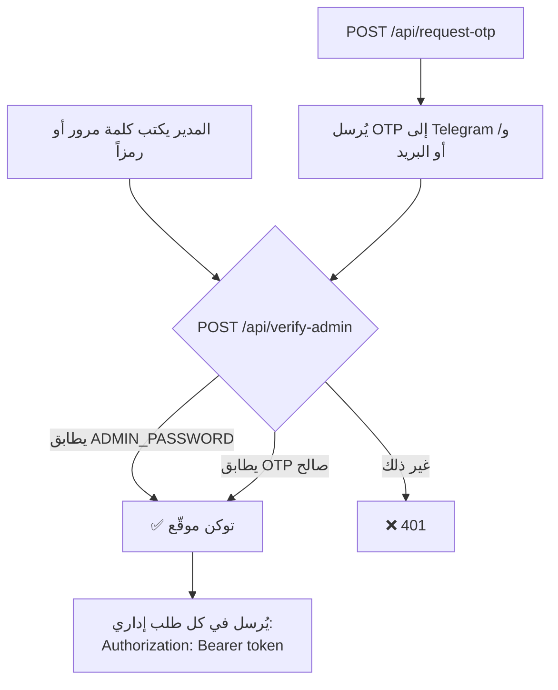

# 3️⃣ الخادم والـ API (Backend)

الخادم كله في ملف واحد: `server.ts` (≈ 770 سطر). يعمل بـ Express 4 ويُشغَّل بـ `tsx`.

---

## 1. ترتيب التهيئة في `server.ts`

1. تحميل `.env` عبر `dotenv`.
2. `app.disable('x-powered-by')` و`app.set('trust proxy', 1)` (الخادم خلف وسيط واحد).
3. **ترويسات أمان** على كل الردود: `X-Content-Type-Options: nosniff`، `X-Frame-Options: SAMEORIGIN`، `Referrer-Policy`، `Permissions-Policy`؛ وفي الإنتاج أيضاً `Content-Security-Policy-Report-Only` (يسجّل ولا يحجب).
4. **قارئات JSON** بحدود مختلفة (تُسجَّل الأخص أولاً):
   | المسار | الحد |
   | :--- | :--- |
   | `/api/upload-image` | 8 MB |
   | أي مسار آخر | 1 MB |
5. أدوات الأمان: `rateLimit` و`signAdminToken` و`isValidAdminToken` و`requireAdmin` و`safeEqual` و`escapeHtml`.
6. مسارات الـ API، ثم الملفات الثابتة (مع ترويسات الكاش)، ثم Vite (تطوير) أو `dist/` (إنتاج).

---

## 2. المتغيرات البيئية (`.env`)

| المتغير | مطلوب؟ | الافتراضي | الاستخدام |
| :--- | :-: | :--- | :--- |
| `PORT` | لا | `3300` | منفذ الخادم |
| `NODE_ENV` | لا | — | `production` يقدّم `dist/`، غير ذلك يشغّل Vite |
| `ADMIN_PASSWORD` | **نعم** للدخول بكلمة مرور | **لا يوجد** | كلمة مرور الإدارة. إن تُركت فارغة يعمل الدخول بالرمز المؤقت فقط |
| `SESSION_SECRET` | موصى به | `ADMIN_PASSWORD` ثم قيمة عشوائية عند كل إقلاع | مفتاح توقيع جلسات الإدارة |
| `TELEGRAM_BOT_TOKEN` | لتيليغرام | — | توكن البوت (يقبل أيضاً رابط API كاملاً فينظّفه `sanitizeTelegramToken`) |
| `TELEGRAM_CHAT_ID` | لتيليغرام | — | معرّف المحادثة |
| `SMTP_HOST` | لا | `smtp.gmail.com` | خادم البريد |
| `SMTP_PORT` | لا | `587` | المنفذ (`465` = اتصال مشفّر مباشر `secure`) |
| `SMTP_USER` | للبريد | — | حساب البريد |
| `SMTP_PASS` (أو `EMAIL_APP_PASSWORD`) | للبريد | — | كلمة مرور التطبيق |
| `EMAIL_FROM` | لا | `SMTP_USER` | عنوان المرسل |
| `EMAIL_ALERT_ADDRESS` | لا | `SMTP_USER` | وجهة التنبيهات (يمكن تجاوزها من لوحة الإدارة) |
| `GITHUB_TOKEN` | لا | — | توكن GitHub للقراءة فقط (بلا صلاحيات) يرفع حد الخادم إلى 5000 طلب/ساعة |
| `TRUST_CLOUDFLARE_HEADERS` | لا | `false` | `true` = استخدام `CF-Connecting-IP` كعنوان الزائر لتحديد المعدل. **فعّله فقط** إن كان الموقع لا يُوصَل إلا عبر Cloudflare (المنفذ 3300 مغلق عن الإنترنت) وإلا يمكن تزوير الترويسة |
| `DISABLE_HMR` | لا | — | في `vite.config.ts`: `true` يعطّل HMR (خاص بمنصة AI Studio) |


---

## 3. المصادقة (Authentication)



- **التوكن:** `"<انتهاء-بالميلي-ثانية>.<HMAC-SHA256>"`، صلاحيته **ساعتان**، يُتحقق منه بـ `timingSafeEqual`.
- **الرمز المؤقت (OTP):** 6 أرقام عبر `crypto.randomInt`، صالح **10 دقائق**، **استخدام واحد**، محفوظ في ذاكرة العملية (يضيع عند إعادة التشغيل)، ولا يُكتب في السجل.
- **المقارنات** كلها بزمن ثابت (`safeEqual`).

---

## 4. تحديد معدل الطلبات (Rate limiting)

في الذاكرة، لكل `IP` ولكل مسار. عند التجاوز: `429` مع `Retry-After`.

| المسار | الحد |
| :--- | :--- |
| `POST /api/verify-admin` | 10 طلبات / 15 دقيقة |
| `POST /api/request-otp` | 3 طلبات / 15 دقيقة |
| `POST /api/contact` | 5 طلبات / ساعة |
| `POST /api/visit` | 1 طلب / ساعة |
| `GET /api/github` | 60 طلباً / ساعة |

> ⚠️ **خلف Cloudflare أو وسيط:** `IP` مأخوذ من `X-Forwarded-For` (قفزة واحدة موثوقة)، أو من `CF-Connecting-IP` إن فعّلت `TRUST_CLOUDFLARE_HEADERS`. إن ظهر في السجلات أن كل الزوار بنفس العنوان فسيتشارك الجميع نفس الحد؛ فعّل الخيار المناسب لبنيتك.

---

## 5. جدول المسارات

الاختصارات: 🌐 عام · 🔐 يحتاج توكن إدارة.

### 5.1 الملف الشخصي (المحتوى)

| الطريقة والمسار | الوصول | الوصف |
| :--- | :-: | :--- |
| `GET /api/portfolio` | 🌐 | يعيد المحتوى المحفوظ (`portfolio-store.json`) أو `null`. غير المدير يحصل على `telegramBotToken` و`telegramChatId` فارغين |
| `POST /api/portfolio` | 🔐 | يحفظ المحتوى. يتحقق من: `name` نص غير فارغ، `portraitImage` نص غير فارغ، و`experiences/projects/education/skills` مصفوفات (وإلا `400`). **يفرّغ دائماً** `telegramBotToken` و`telegramChatId`. بعد الحفظ **يحذف الصور المرفوعة** (`user_upload_*`) التي كانت مستخدمة وصارت غير مستخدمة |
| `POST /api/reset-portfolio` | 🔐 | يحذف `portfolio-store.json` فيعود الموقع للمحتوى الافتراضي. لا يمس الرسائل |

### 5.2 الرسائل والتواصل

| الطريقة والمسار | الوصول | الوصف |
| :--- | :-: | :--- |
| `POST /api/contact` | 🌐 (محدود) | **جسم الطلب:** `name`, `email`, `subject?`, `message`. **الحدود:** الاسم 100، البريد 150، الموضوع 150 (الافتراضي «Direct Inquiry»)، الرسالة 4000 حرف. يتحقق من صيغة البريد وأن الاسم والرسالة غير فارغين وإلا `400`. يحفظ في `messages-store.json` (آخر 500 رسالة) ثم يرسل التنبيهات حسب إعدادات التكاملات. **الرد:** `{success:true, message:{id,name,email,subject,message,date,isRead:false}}`. **مصيدة بوتات:** الحقل `website` يجب أن يبقى فارغاً؛ إن امتلأ يرد الخادم نجاحاً شكلياً دون حفظ أو تنبيه |
| `GET /api/messages` | 🔐 | كل الرسائل |
| `PATCH /api/messages/:id/read` | 🔐 | تعليم رسالة واحدة كمقروءة (`404` إن لم توجد) |
| `DELETE /api/messages/:id` | 🔐 | حذف رسالة واحدة (`404` إن لم توجد) |

> لا يوجد `POST /api/messages` لاستبدال الصندوق كاملاً: هذا يمنع ضياع رسائل وصلت أثناء فتح لوحة الإدارة.

### 5.3 الدخول والتنبيهات

| الطريقة والمسار | الوصول | الوصف |
| :--- | :-: | :--- |
| `POST /api/verify-admin` | 🌐 (محدود) | **جسم:** `{code}`. **نجاح:** `{success:true, token}`. **فشل:** `401 {success:false, error}` |
| `POST /api/request-otp` | 🌐 (محدود) | يولّد رمزاً ويرسله. **الرد:** `{success, codeSent, channels[], message}` (لا يتضمن الرمز أبداً) |
| `POST /api/visit` | 🌐 (محدود) | **جسم:** `{lang}`. يرسل تنبيه زيارة إلى تيليغرام **فقط** إن كان `visitAlertsEnabled` مفعلاً في لوحة الإدارة، ويتجاهل الروبوتات وأدوات المراقبة (حسب `User-Agent`). يرد دائماً `{success:true}` |
| `POST /api/notify-telegram` | 🔐 | **جسم:** `{message}` (HTML). يستخدم بيانات `.env` فقط. (يُستخدم لزر الاختبار) |
| `POST /api/notify-email` | 🔐 | **جسم:** `{to?, subject, body}`. يرسل عبر SMTP، وإن لم يُضبط SMTP يكتفي بتسجيل الرسالة في السجل ويرد نجاحاً مع تنبيه نصي |
| `GET /api/integrations-status` | 🔐 | `{telegram:boolean, email:boolean}` — هل الإعدادات موجودة في `.env` (دون كشف القيم) |

### 5.4 الصور

| الطريقة والمسار | الوصول | الوصف |
| :--- | :-: | :--- |
| `POST /api/upload-image` | 🔐 | **جسم:** `{base64Data, fileName}` حيث `base64Data` رابط `data:image/(png\|jpeg\|webp\|gif);base64,...`. **الفحوص:** الحجم ≤ 5MB وأكبر من 100 بايت؛ **نوع الملف الحقيقي** يُحدَّد من أول بايتات الملف (PNG/JPEG/GIF/WEBP) لا من الاسم أو MIME. **الحفظ:** `src/assets/images/user_upload_<وقت>_<عشوائي>.<ext>`. **الرد:** `{success, imageUrl:"/src/assets/images/..."}` |
| `GET /api/github` | 🌐 (محدود) | حساب GitHub المضبوط في لوحة الإدارة (أو `amr88nzzal`): `{user:{public_repos,followers,created_at,location,html_url}, repos:[...]}`. يخزَّن 15 دقيقة، وعند فشل GitHub يعيد آخر نسخة مخزّنة أو `{user:null,repos:[]}`. يُرجِع المستودعات غير المستنسخة فقط (حتى 12) |

---

## 6. التنبيهات: متى يُرسل ماذا؟

| الحدث | تيليغرام | بريد |
| :--- | :--- | :--- |
| رسالة من نموذج التواصل | إن كان `telegramEnabled` مفعلاً في لوحة الإدارة **و** `.env` مضبوط | إن كان `emailEnabled` مفعلاً (الافتراضي نعم) **و** SMTP مضبوط؛ الوجهة: بريد لوحة الإدارة ثم `EMAIL_ALERT_ADDRESS` ثم `SMTP_USER` |
| زيارة جديدة | إن كان `visitAlertsEnabled` مفعلاً **و** `.env` مضبوط | — |
| رمز دخول مؤقت (OTP) | دائماً إن كان `.env` مضبوطاً | دائماً إن كان SMTP مضبوطاً |

**حماية من الحقن:** نصوص الزائر تُمرَّر عبر `escapeHtml` قبل وضعها في رسائل Telegram (HTML) أو في قالب البريد.

---

## 7. الملفات الثابتة والتخزين

| المسار | الوصف |
| :--- | :--- |
| `data/portfolio-store.json` | المحتوى المعدَّل من لوحة الإدارة |
| `data/messages-store.json` | الرسائل (مصفوفة، الأحدث أولاً، بحد أقصى 500) |
| `src/assets/images/` | الصور المرفوعة وصور المشاريع (تُخدَّم على `/src/assets/images`) |

> مجلد `data/` يُنشأ تلقائياً عند الإقلاع، وهو **خارج Git** (`.gitignore`) وفي Docker على وحدة دائمة `portfolio_data`.

---

## 8. أمثلة طلبات (curl)

```bash
# إرسال رسالة تواصل
curl -X POST https://amrodev.com/api/contact \
  -H 'Content-Type: application/json' \
  -d '{"name":"Test","email":"test@example.com","subject":"Hi","message":"Hello"}'

# الدخول ثم قراءة الرسائل
TOKEN=$(curl -s -X POST https://amrodev.com/api/verify-admin \
  -H 'Content-Type: application/json' -d '{"code":"ADMIN_PASSWORD"}' | jq -r .token)
curl -H "Authorization: Bearer $TOKEN" https://amrodev.com/api/messages
```

## 9. دوال الخادم القابلة للاختبار (`backend/utils.ts`)

دوال نقية بلا Express، يستوردها `server.ts` وتغطيها الاختبارات:

| الدالة | الوظيفة |
| :--- | :--- |
| `safeEqual`, `escapeHtml`, `EMAIL_PATTERN` | مقارنة آمنة، تهريب HTML، فحص البريد |
| `createSessionTokens(secret, ttl)` | `sign()` و`verify()` لجلسات الإدارة |
| `createRateLimiter()` | `check(key, max, windowMs)` و`cleanup()` لتحديد المعدل |
| `detectImageType(buffer)` | نوع الصورة الحقيقي من أول البايتات |
| `UPLOAD_NAME`, `referencedImageFiles`, `orphanedUploads` | منطق حذف الصور المرفوعة غير المستخدمة |
| `sanitizeTelegramToken`, `isBotUserAgent` | تنظيف التوكن، وكشف الروبوتات |

> منطق جديد في الخادم؟ ضعه هنا كدالة نقية وأضف له اختباراً (`docs/09-testing.md`).

## 10. رموز الأخطاء الشائعة

| الرمز | المعنى |
| :-: | :--- |
| `400` | بيانات ناقصة أو غير صالحة (بريد خاطئ، صورة ليست صورة، بنية محتوى ناقصة) |
| `401` | لا توكن أو منتهٍ أو كلمة مرور خاطئة |
| `404` | رسالة غير موجودة |
| `413` | صورة أكبر من الحد |
| `429` | تجاوز حد الطلبات |
| `500` | خطأ داخلي (راجع `docker compose logs`) |
