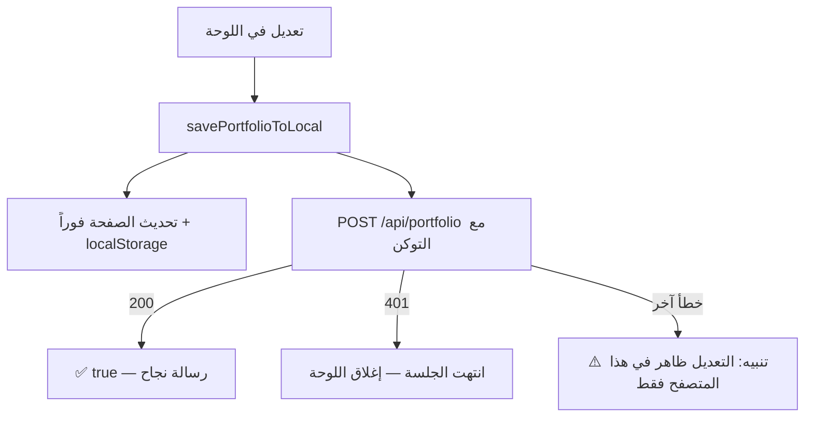

# 5️⃣ لوحة الإدارة (CMS)

لوحة مدمجة في `App.tsx` تتيح تعديل محتوى الموقع وقراءة الرسائل دون تعديل الكود.

---

## 1. الدخول

### إظهار أيقونة القفل
الأيقونة **مخفية عن الزوار**. تظهر عند فتح الموقع بإحدى الصيغتين:

```
https://amrodev.com/#admin
https://amrodev.com/?admin
```

ثم اضغط القفل في الشريط العلوي.

### طريقتا الدخول

| الطريقة | الشرط | الخطوات |
| :--- | :--- | :--- |
| **كلمة المرور** | ضبط `ADMIN_PASSWORD` في `.env` | اكتبها في الحقل ثم «فتح» |
| **رمز مؤقت (OTP)** | ضبط Telegram و/أو SMTP في `.env` | اضغط «إرسال رمز دخول مؤقت»، استلم الرمز (6 أرقام) واكتبه. صالح 10 دقائق ولمرة واحدة |

- لا توجد كلمة مرور افتراضية. إن لم تضبط `ADMIN_PASSWORD` فلن تعمل إلا طريقة OTP.
- بعد 10 محاولات فاشلة تُحظر 15 دقيقة. طلب OTP مسموح 3 مرات كل 15 دقيقة.

### الجلسة
- الخادم يعيد **توكن موقّعاً صالحاً ساعتين**.
- يُحفظ في **ذاكرة الصفحة فقط** (متغير React) — **تحديث الصفحة يُنهي الجلسة**.
- عند انتهاء الجلسة أثناء الحفظ تظهر رسالة وتُغلق اللوحة لتسجّل الدخول من جديد.
- زر «Close CMS» أسفل اللوحة يُنهي الجلسة فوراً.

---

## 2. منطق الحفظ (مهم لفهم السلوك)



- رسالة «تم الحفظ» لا تظهر إلا عند **تأكيد الخادم**.
- عند فشل الحفظ على الخادم يبقى التعديل ظاهراً لك فقط (في متصفحك) وتصلك رسالة تنبّهك.
- الخادم يرفض أي بنية ناقصة (اسم فارغ، مصفوفات مفقودة...) بـ `400` فلا يمكن مسح المحتوى بطلب خاطئ.

---

## 3. التبويبات

### 3.1 Profile — الملف الشخصي

| الحقل | ملاحظات |
| :--- | :--- |
| الاسم | مطلوب (لا يُحفظ فارغاً) |
| البريد | يُتحقق من صيغته |
| الهاتف | يمكن تركه فارغاً (يختفي زر الاتصال) |
| الصورة الشخصية | انظر القسم 4 |
| روابط التواصل (GitHub, Telegram, WhatsApp, X, LinkedIn) | يجب أن تبدأ بـ `https://` أو تُترك فارغة (الفارغ لا يُعرض) |
| المسمى المهني | EN / AR / DE (الفارغ يحتفظ بالقيمة السابقة) |
| النبذة التعريفية (Summary) | EN / AR / DE، أربعة أسطر لكل لغة |
| الموقع (Location) | EN / AR / DE |

زر **Save Info** يحفظ كل الحقول معاً.

### 3.2 Experiences — الخبرات
- **Add Experience**: يُنشئ عنصراً جديداً (`exp-<وقت>`) في **أول** القائمة.
- أيقونة العين: تحرير. أيقونة السلة: حذف (بتأكيد).
- الحقول: الشركة، الفترة، الموقع (3 لغات)، المسمى (3 لغات)، والنقاط (3 لغات).
- النقاط: **سطر لكل نقطة** (Enter بين النقاط)، والأسطر الفارغة تُحذف تلقائياً عند الحفظ.
- تذكير: تبويبات الفلترة في الموقع تعتمد على نص اسم الشركة (`bmw` / `sahli` / `aljawaden`).

### 3.3 Projects — المشاريع
- **Add Project**، تحرير، حذف.
- الحقول: **رفع صورة** (مع معاينة)، رابط العرض، التقنيات (مفصولة بفاصلة)، والعنوان والتصنيف والوصف والنتيجة (3 لغات).
- تذكير: المشاريع تظهر بشارة **Demo**؛ اكتب الوصف والنتيجة على أنها إمكانيات المشروع التجريبي لا نتائج عميل.

### 3.4 Education — المؤهلات
إضافة / تحرير / حذف. الحقول: الفترة، الدرجة، الجهة، التفاصيل (3 لغات).

### 3.5 Skills — المهارات
- تحرير الفئات **الموجودة** فقط (عنوان بالثلاث لغات).
- داخل الفئة: إضافة مهارة، حذف مهارة، تغيير الاسم والمستوى (1–5).
- لا يوجد زر لإضافة/حذف **فئة** كاملة (يحتاج تعديل الكود).
- زر **Cancel** يتجاهل التعديلات (يعمل على نسخة مستقلة).

### 3.6 Integrations — التنبيهات

| المفتاح | الأثر |
| :--- | :--- |
| Send contact-form messages to Telegram | تنبيه تيليغرام عند وصول رسالة |
| Alert me about new site visits | تنبيه زيارة (مرة في الساعة كحد أقصى لكل زائر) |
| E-mail me contact-form messages | تنبيه بريد |
| Alert destination e-mail | وجهة البريد (إن فارغة تُستخدم قيمة `.env`) |

- الأسرار (توكن البوت، معرّف المحادثة، SMTP) **لا تُدخل هنا**؛ تُضبط في `.env` فقط.
- كل قسم يعرض حالة الخادم: **مُهيّأ** (أخضر) أو **غير مُهيّأ** (أحمر مع اسم المتغيرات المطلوبة).
- أزرار **اختبار** تيليغرام والبريد تظهر فقط عند التهيئة.
- ⚠️ لتفعيل التنبيهات اضغط **حفظ** بعد تعديل المفاتيح (الخادم يقرأ الإعدادات من الملف المحفوظ).

### 3.7 Inbox — الرسائل
- تُحمَّل من الخادم عند فتح التبويب، وزر **تحديث** لإعادة التحميل.
- **مقروء** و**حذف** يعملان على رسالة واحدة فقط (`PATCH`/`DELETE` بمعرّفها) فلا تضيع رسائل وصلت أثناء فتح اللوحة.
- الرقم بين القوسين في اسم التبويب `Inbox (N)` = عدد الرسائل غير المقروءة.

### 3.8 أزرار عامة
- **Restore Default CV**: يعيد محتوى السيرة إلى `data.ts` (يحذف `portfolio-store.json`) ويُغلق اللوحة. **لا يمس الرسائل.**
- **Close CMS**: ينهي الجلسة.

---

## 4. رفع الصورة الشخصية (الاستبدال)

1. افتح **Profile** ← **اختيار صورة جديدة**، واختر ملف JPG/PNG/WEBP.
2. المتصفح **يصغّر الصورة تلقائياً** (حتى 1400 بكسل، JPEG بجودة 0.86) فتناسب حد الخادم حتى لو كانت صورة هاتف كبيرة.
3. تُرفع إلى `POST /api/upload-image` فيتحقق الخادم من **نوع الملف الفعلي** والحجم ويحفظها باسم فريد `user_upload_….jpg`.
4. تظهر **معاينة كبيرة** بنسبة 4:5 (كما في الموقع) مع رسالة «الصورة الجديدة جاهزة. اضغط حفظ».
5. اضغط **Save Info** لنشرها فعلياً.
6. عند الحفظ، **تُحذف تلقائياً من الخادم** الصورة المرفوعة السابقة إن لم تعد مستخدمة في أي مكان (أي حقل في المحتوى).
7. زر **استعادة الصورة الافتراضية** يعيد الصورة المعرّفة في `data.ts`.

**ما لا يُحذف تلقائياً:** الملفات التي لم تُرفع عبر اللوحة (مثل `profile.jpg` وصور المشاريع الأصلية) — فقط الملفات التي تبدأ بـ `user_upload_`.

> الصور المرفوعة تُخدَّم على `/src/assets/images/…` ولها أسماء فريدة، فلا مشكلة كاش في Cloudflare عند تغيير الصورة.

---

## 5. الأخطاء الشائعة وحلولها

| المشكلة | السبب | الحل |
| :--- | :--- | :--- |
| لا أرى أيقونة القفل | مخفية | افتح `/#admin` |
| «كلمة المرور خاطئة» دائماً | `ADMIN_PASSWORD` غير مضبوط في `.env` أو لم تُعد تشغيل الحاوية | اضبطه ثم `docker compose up -d --build` |
| لا يصلني OTP | Telegram/SMTP غير مضبوط | راجع حالة التكاملات و`docker compose logs` |
| 429 | تجاوز حد المحاولات | انتظر 15 دقيقة |
| «انتهت جلسة الإدارة» | مرّت ساعتان أو حُدّثت الصفحة | سجّل الدخول من جديد |
| التعديل لا يظهر لزائر آخر | فشل الحفظ على الخادم أو كاش Cloudflare | راجع رسالة التحذير؛ امسح كاش Cloudflare |
| الصورة القديمة ما زالت تظهر | ملف قديم في وحدة Docker أو كاش CDN | انظر `06-deployment-operations.md` |
| لا أستطيع رفع صورة | الملف ليس صورة، أو الجلسة انتهت | اختر JPG/PNG/WEBP وسجّل الدخول |
