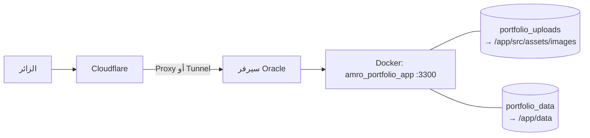

# 6️⃣ النشر والتشغيل (Deployment & Operations)

> الدليل الأصلي لإعداد Oracle Cloud وCloudflare والجدار الناري في [`DEPLOYMENT.md`](../DEPLOYMENT.md). هذا الملف يشرح **الحاوية والوحدات والتشغيل اليومي وحل المشاكل**.

---

## 1. نظرة عامة على النشر



| العنصر | القيمة |
| :--- | :--- |
| اسم الخدمة | `amro-portfolio` |
| اسم الحاوية | `amro_portfolio_app` |
| المنفذ | `3300` |
| سياسة الإعادة | `restart: always` |
| الفحص الصحي | `wget --spider http://localhost:3300/` كل 30 ثانية |

---

## 2. الـ Dockerfile (مرحلتان)

| المرحلة | ما تفعله |
| :--- | :--- |
| **builder** | يثبّت الحزم (`npm ci` إن وُجد `package-lock.json` وإلا `npm install --legacy-peer-deps`) ثم `npm run build` (يبني الواجهة إلى `dist/`) |
| **runner** | ثبّت `tsx` عالمياً، ثم اعتماديات الإنتاج فقط (`--omit=dev`)، وانسخ `dist/` و`server.ts` و`backend/` و`src/` و`public/`، وأنشئ `/app/src/assets/images` و`/app/data`، ثم `CMD ["tsx","server.ts"]` |

متغيرات الصورة: `NODE_ENV=production` و`PORT=3300`.

### ملف القفل (`package-lock.json`)
غيابه يعني أن كل بناء قد يثبّت إصدارات أحدث من الحزم. لتثبيت الإصدارات (مرة واحدة على جهازك):

```bash
npm install --legacy-peer-deps      # يولّد package-lock.json
git add package-lock.json && git commit -m "Add lock file"
```
بعدها يستخدم الـ Dockerfile `npm ci` تلقائياً. (كان `bun.lock` موجوداً لكن غير مستخدم فحُذف.)

---

### ملف `.dockerignore`
يمنع نسخ `.env` و`data/` و`node_modules` و`.git` وملفات `.md` إلى سياق البناء، فلا تدخل الأسرار طبقات الصورة.

## 3. الوحدات (Volumes) — أهم نقطة تشغيلية

| الوحدة | تُركَّب على | تحتوي |
| :--- | :--- | :--- |
| `portfolio_data` | `/app/data` | `portfolio-store.json` و`messages-store.json` |
| `portfolio_uploads` | `/app/src/assets/images` | الصور المرفوعة وصور المشاريع |

### ⚠️ سلوك الوحدات المسماة
الوحدة المسماة **تُملأ من محتوى الصورة مرة واحدة** عند إنشائها. بعدها:
- ما بداخلها يتغلب على أي ملف بنفس الاسم في **البناء الجديد**.
- ملف جديد تضيفه في `src/assets/images/` بالمستودع **لا يصل** للحاوية العاملة.

**لذلك:** الصور الثابتة الجديدة توضع في `public/` (مثل `public/images/`)، وهو غير مغطّى بوحدة.

### أوامر العمل مع الصور داخل الحاوية
```bash
docker compose exec amro-portfolio ls -la /app/src/assets/images
docker compose exec amro-portfolio md5sum /app/src/assets/images/profile.jpg
docker compose exec amro-portfolio rm /app/src/assets/images/اسم-الملف
```
لا تحذف صور المشاريع (`pos_*` `invscan_*` `afaq_*` `erp_*` `inventory_*`) فالمشاريع التجريبية تستخدمها. ويمكن لاحقاً نقلها إلى `public/` وتحديث مساراتها.

---

## 4. إعداد `.env` على السيرفر

```bash
cp .env.example .env
nano .env
```

القيم الأساسية (الشرح الكامل في `03-backend-api.md`):

```ini
ADMIN_PASSWORD="كلمة-طويلة-عشوائية"     # openssl rand -base64 24
SESSION_SECRET="قيمة-عشوائية-أخرى"       # openssl rand -base64 32
TELEGRAM_BOT_TOKEN="..."
TELEGRAM_CHAT_ID="..."
SMTP_HOST="smtp.gmail.com"
SMTP_PORT="587"
SMTP_USER="you@example.com"
SMTP_PASS="كلمة مرور التطبيق"
EMAIL_ALERT_ADDRESS="you@example.com"
GITHUB_TOKEN=""                             # اختياري: يرفع حد GitHub API للخادم
TRUST_CLOUDFLARE_HEADERS="false"           # "true" فقط إن كان المنفذ 3300 مغلقاً ولا يُوصَل إلا عبر Cloudflare
```

> `docker-compose.yml` يمرّر هذه المتغيرات للحاوية. **أي تغيير في `.env` يحتاج إعادة تشغيل/بناء** الحاوية.
> ملف `.env` مستثنى من Git (`.gitignore`). لا ترفعه أبداً.

### الحصول على بيانات تيليغرام
1. كلّم `@BotFather` وأنشئ بوتاً بـ `/newbot` ← انسخ التوكن.
2. كلّم `@userinfobot` للحصول على `Chat ID`.
3. **ابدأ محادثة مع بوتك** وأرسل له أي رسالة (وإلا لن يستطيع مراسلتك).

---

## 5. التشغيل والتحديث

### أول نشر
```bash
git clone https://github.com/amr88nzzal/myportfolio.git
cd myportfolio
cp .env.example .env && nano .env
./deploy.sh            # = docker compose up -d --build
docker compose ps
```

### تحديث بعد تعديل الكود
```bash
cd myportfolio
git pull
docker compose up -d --build      # لا يحذف الوحدات (البيانات والصور تبقى)
docker compose logs -f --tail=100 amro-portfolio
```

> ⚠️ **لا تستخدم** `docker compose down -v` ولا `docker volume rm` إلا إن أردت حذف الرسائل والصور والمحتوى المخزّن.

### ملاحظة عن `deploy.sh`
يتحقق من وجود `.env` ثم ينفّذ `docker compose up -d --build --remove-orphans` (دون إيقاف مسبق فيقلّ زمن التوقف) وينظّف الصور اليتيمة. تبقى الوحدات كما هي.

---

## 6. النسخ الاحتياطي والاستعادة

أسماء الوحدات تبدأ باسم المجلد/المشروع (مثل `myportfolio_portfolio_data`). اعرضها أولاً:

```bash
docker volume ls | grep portfolio
```

### نسخ احتياطي
```bash
mkdir -p ~/backups
docker run --rm -v myportfolio_portfolio_data:/data -v ~/backups:/backup alpine \
  tar czf /backup/portfolio-data-$(date +%F).tgz -C /data .
docker run --rm -v myportfolio_portfolio_uploads:/data -v ~/backups:/backup alpine \
  tar czf /backup/portfolio-uploads-$(date +%F).tgz -C /data .
```

### استعادة
```bash
docker run --rm -v myportfolio_portfolio_data:/data -v ~/backups:/backup alpine \
  sh -c "cd /data && tar xzf /backup/portfolio-data-YYYY-MM-DD.tgz"
docker compose restart amro-portfolio
```

> الأهم نسخ `portfolio_data` (الرسائل والمحتوى). يُنصح بجدولته أسبوعياً بـ `cron`.

---

## 7. Cloudflare

| الخيار | ملاحظات |
| :--- | :--- |
| **DNS Proxy** (سجل A برتقالي) | كما في `DEPLOYMENT.md`؛ يحتاج فتح المنفذ على السيرفر |
| **Tunnel** (`cloudflared`) | لا يحتاج فتح منافذ؛ يشير إلى `http://localhost:3300` |

### الكاش
Cloudflare قد يخزّن الصور على روابط ثابتة. إن غيّرت ملفاً بنفس الاسم وبقيت القديمة تظهر:
- لوحة Cloudflare ← **Caching** ← **Configuration** ← **Purge Cache** ← **Custom Purge** وأدخل رابط الملف.
- للتأكد: افتح أدوات المطور ← Network ← الطلب ← ترويسة `cf-cache-status` (`HIT` = من الكاش).
- اختبار سريع لتجاوز الكاش: أضف `?x=1` للرابط.

الصور المرفوعة من لوحة الإدارة وصورة `public/images/amro-portrait.jpg` تستخدم أسماءً/مسارات جديدة، فلا تتأثر بكاش قديم.

### عنوان IP للزائر وتحديد المعدل
الخادم يثق بوسيط واحد (`trust proxy = 1`). تأكد (من السجلات أو باختبار) أن عناوين الزوار تظهر مختلفة؛ وإلا فسيشترك الجميع في حد `5 رسائل/ساعة`. إن كان الموقع لا يُوصَل إلا عبر Cloudflare (المنفذ 3300 مغلق) فعّل `TRUST_CLOUDFLARE_HEADERS=true`.

---

## 8. المراقبة والسجلات

```bash
docker compose ps                              # الحالة والصحة
docker compose logs -f --tail=200 amro-portfolio
docker inspect --format='{{.State.Health.Status}}' amro_portfolio_app
```

أسطر مفيدة في السجل:

| السطر | المعنى |
| :--- | :--- |
| `Server running at http://localhost:3300` | الإقلاع ناجح |
| `[ADMIN AUTH] Admin unlocked via password/one-time code` | دخول ناجح |
| `[ADMIN AUTH] Failed unlock attempt` | محاولة فاشلة |
| `[PORTFOLIO SYNC] Successfully persisted...` | حفظ محتوى |
| `[IMAGE UPLOAD] Saved custom profile photo to:` | رفع صورة |
| `Telegram alert failed` / `Email alert failed` | فشل تنبيه (راجع التوكن/SMTP) |

---

## 9. حل المشاكل (Troubleshooting)

| العَرَض | السبب المحتمل | الحل |
| :--- | :--- | :--- |
| الصورة الشخصية قديمة بعد التحديث | ملف قديم في وحدة الصور، أو كاش Cloudflare | `?x=1` على رابط الصورة: إن ظهرت الجديدة فهو الكاش (Purge)؛ وإلا قارن `md5sum` داخل الحاوية واحذف الملف القديم. الصورة الافتراضية الآن في `public/images/` |
| التعديل في `data.ts` لا يظهر | المحتوى المخزّن أحدث | ارفع `dataVersion` أو اضغط «Restore Default CV» |
| لا أستطيع دخول الإدارة | `ADMIN_PASSWORD` غير مضبوط/لم تُعد التشغيل، أو حد المحاولات | اضبطه وأعد البناء؛ انتظر 15 دقيقة؛ جرّب OTP |
| لا تصل تنبيهات تيليغرام | لم تبدأ محادثة مع البوت، أو التوكن/المعرّف خطأ، أو المفتاح غير مفعّل في اللوحة | من اللوحة: تبويب التكاملات ← حالة الخادم ← زر الاختبار؛ راجع السجل |
| لا تصل تنبيهات البريد | SMTP خطأ (Gmail يحتاج «كلمة مرور تطبيق») | اختبر من اللوحة؛ راجع `Email alert failed` |
| بطاقات GitHub فارغة | حد GitHub API (60/ساعة/IP) أو لا مستودعات عامة | انتظر، أو أضف جلب من الخادم بتوكن |
| `429 Too many requests` | تجاوز حد المعدل | انتظر مدة `Retry-After` |
| الموقع لا يفتح بعد التحديث | خطأ في البناء | `docker compose logs`، وجرّب `npm run build` محلياً |
| خطأ `EADDRINUSE` | المنفذ 3300 مشغول | أوقف الحاوية القديمة `docker compose down` |

---

## 10. قائمة التحقق بعد كل نشر

- [ ] `docker compose ps` يظهر `healthy`.
- [ ] الصفحة الرئيسية تعمل بالعربية والإنجليزية والألمانية.
- [ ] الصورة الشخصية صحيحة (جرّب `?x=1` عند الشك).
- [ ] إرسال رسالة تواصل تجريبية ← تظهر في الصندوق وتصل التنبيهات.
- [ ] الدخول إلى `/#admin` يعمل، وحفظ تعديل بسيط ينجح.
- [ ] الموقع على الموبايل (قائمة الأقسام، النموذج).
- [ ] معاينة المشاركة (WhatsApp/LinkedIn) تُظهر صورة `og-image.png`.
